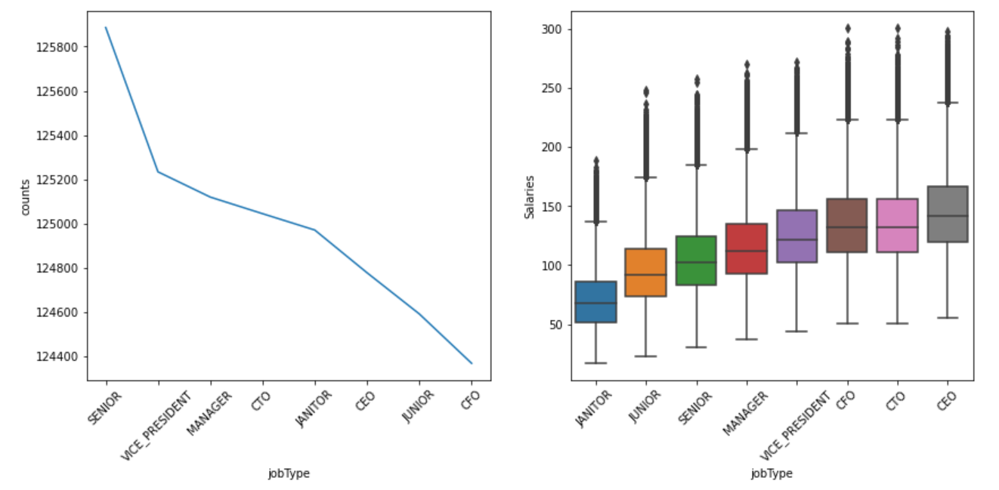

# Salary Prediction Project 

## 1. Define Problem
The purpose of this project is to build a predictive model that can make salary predictions based on given job dispcriptions. With a salary dataset of 1 million job roles along with their associated salaries, I will follow the data science 4D framework of Define, Discover, Develop and Deploy to find the best model with lowest RMSE. 

## 2. Data Discovery & Exploration

### 2.1 Discover Data 
As previously mentioned, the dataset is a combination of 1 million job roles along with their associated salaries. The salary dataset is broken up into the following three csv files:
- train_feature.csv
- train_salaries.csv
- test_feature.csv

Combining the feature and target variables we get following dataframe

The feature and target variables were identified as follows:

#### Feature - [ CompanyID, Degree, Major, milesFromMetroplis, yearsExperience ]

#### Target - [Salary]

### 2.2 Clean Data 
The data cleaning process shows there are no duplicates or missing data.However,statistical analysis on the target column(salary) shows there are 5 rows with 0 salary which indicate invalid data. I removed these rows from the dataset using clean_data().
I will load, clean and perform some explorary data analysis(EDA) on the data before continuing the modeling process

### 2.3 Explore Data EDA 
In this section, I summarize each feature variable and the target variable from the cleaned dataframe. I then looked for any correlation between each feature variable and the target variable

The results above show the following:

- No correlation between compandId and salary
- Positive coorelation between jobType and salary.
- Positive coorelation between degree and salary.
- Positive coorelation between major and salary
- Positive coorelation between industry and salary
- Positive coorelation between yearsExperience and salary
- Negative coorelation between milesFromMetropolis and salary

The results above makes sense. In the real world, salaries are generally higher with more advance job roles or more advance degrees.In addition, salaries are generally higher with more years of experience and lower with distance from the city.

### 2.4 Establish a Baseline
In this section I created a simple model that will serve as the baseline for more advance models. The baseline model was established by taking the mean of the target(salary). I then measured its efficacy using MSE matrics.
### 2.5 Hypothesize a solution
The MSE for the baseline model was calculated to be 1499.07. I will use the following models to improve the current baseline model's results.

- Linear Regression
- Random Forest Regressor
- Gradient Boost Regressor

I choose the 3 models above because the problem we are solving is a regression problem. This can be determined by simply examining the relationship between each feature variable and target in the dataset.The EDA show that there are linear relationships between each feature variable and the target. In addition, there's both positive and negative coorelation between the target variable (salary) and feature variables jobType, degree, major, industry, YearsExperience and milesFromMetropolis.

## 3. Model Development 
### 3.1 Create Models
### 3.2 Test Models
### 3.3 Feature Engineering
### 3.4 Select best Model 
